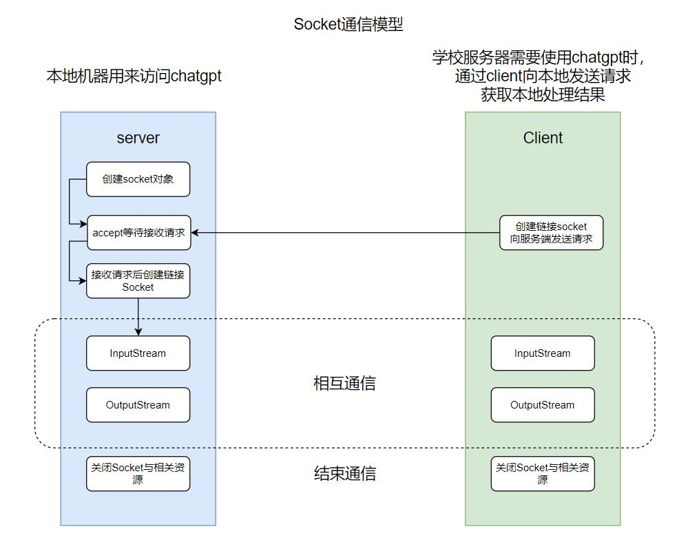

# 基于socket通信的chatgpt使用方法
## Overview
事件起因：想探索一下对话阅读理解任务中调用chatgpt和问答模型交互，用来评估问答模型的回复能力，但是很快遇到一个问题: 问答模型放在学校服务器上，而学校服务器上不能直接调用chatgpt的api。

因此如果实现通过服务器到本机的通信，既可以实现服务器调用chatgpt api。

服务器到本地的通信可以基于**socket**实现， 实现通信需要两个文件，client.py和server.py. server.py放在本地用来启动服务，client.py放在服务器，在需要访问chatgpt时调用client.py的函数run_client(prompt)。



<center>Socket通信模型</center>


## Quick start
1. 确保本地可以访问chatgpt
2. 查看本地ip,查看方法
```shell
# Windows 命令行输入
ipconfig
# Linux 命令行输入
ip address
```
3. 
   * 将第2步得到的ip写入server.py和client.py
   * 本地运行server.py
   * 服务器端 在需要调用chatgpt的py文件里from client import run_client,通过调用run_client(prompt)来使用chatgpt


## 相关知识
[network socket](https://en.wikipedia.org/wiki/Network_socket)

[socket 教程](https://realpython.com/python-sockets/)

[socket编程 中文博客](https://blog.csdn.net/Dustinthewine/article/details/127631711)